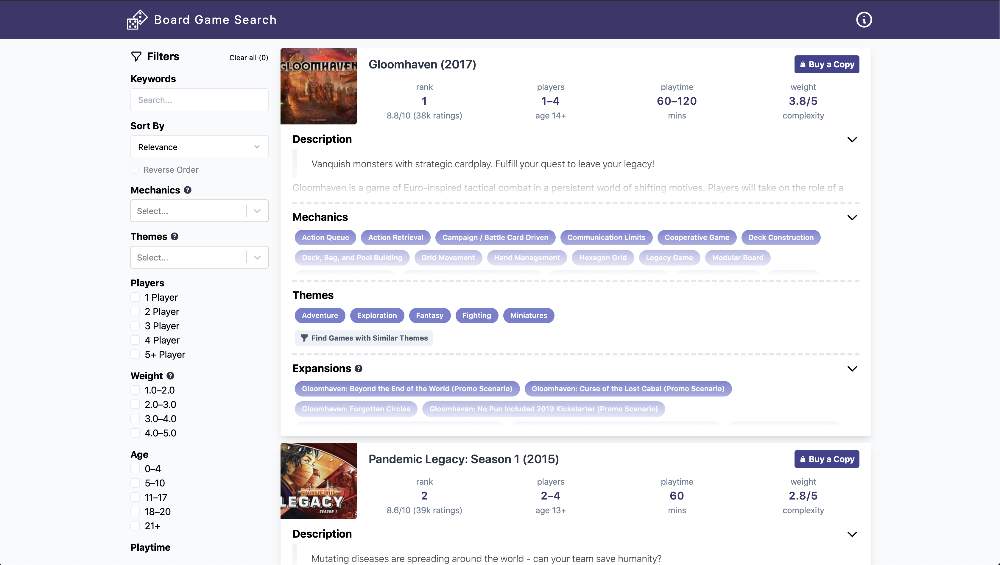

<a href="https://boardgames.bobbyullman.com/" rel="nofollow">
  
</a>

# Board Game Search

> Easily search for and discover your next favorite board game!

[](https://github.com/rjullman/board-game-search/actions?query=workflow%3A%22Lint+Typescript+and+Python%22)
[](https://github.com/rjullman/board-game-search/actions?query=workflow%3A%22Reindex+BoardGameGeek%22)
[](./LICENSE)


Use the tool live at
[boardgames.bobbyullman.com](https://boardgames.bobbyullman.com/). The board
game database is updated daily with the top 10,000 games. All game rankings and
statistics are populated from [BoardGameGeek](http://boardgamegeek.com/).
BoardGameGeek is a great site but tricky to search, especially if you don't
already know what you're looking for – hence this tool.

[](https://boardgames.bobbyullman.com/)

## Local Development

1. Clone this repo:
```
git clone git@github.com:rjullman/board-game-search.git
```

2. Install dependencies:
```
yarn install
python3 -m venv env
. env/bin/activate
pip install -r requirements.txt
```

3. Setup [docker-compose](https://docs.docker.com/compose/install/). 

4. Start the [Next.js](https://nextjs.org/) server and [Elasticsearch](https://www.elastic.co/elasticsearch/):
```
docker-compose up
```

5. Seed the database with the board game data:
```
python ingest.py run --connection http://localhost:9200 --max-rank 10000
```

## Deployment

Pull requests in this repo are automatically build deployed in a preview
environment managed by [Vercel for Github](https://vercel.com/github). Commits
to the `main` branch are automatically deployed to
[boardgames.bobbyullman.com](https://boardgames.bobbyullman.com).

To build the production frontend run `yarn build`.

The environment variables that affect the build are:
- (required) `NEXT_PUBLIC_CANONICAL_URL` - the url of where the site will be deployed
- (optional) `NEXT_PUBLIC_GOOGLE_ANALYTICS_ID` - Google Analytics ID.

Afterwards, to start the Next.js API server run `yarn start`. This requires
setting the `ELASTICSEARCH_ENDPOINT` environment variable. You can get a free
Elasticsearch instance from [Bonsai.io](https://bonsai.io/).
